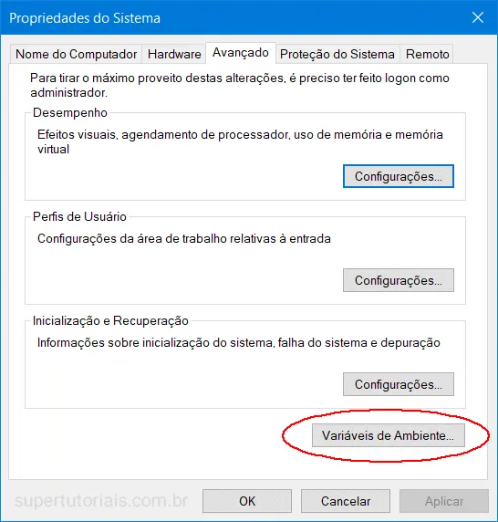
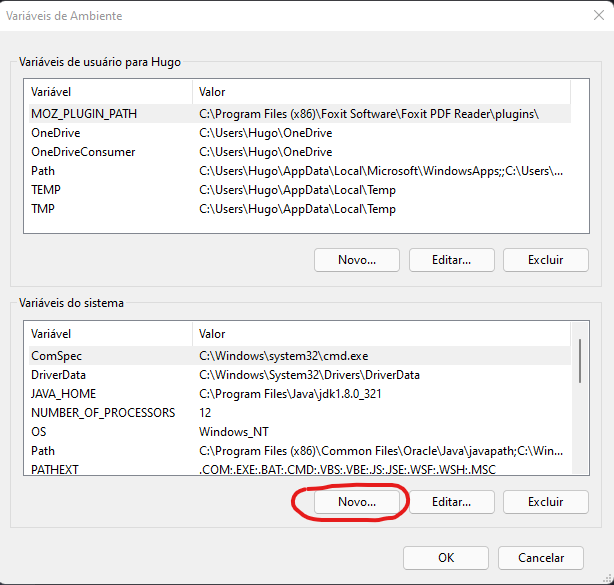
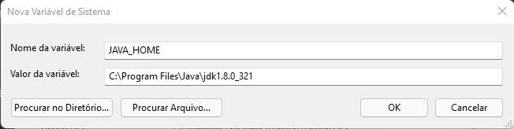
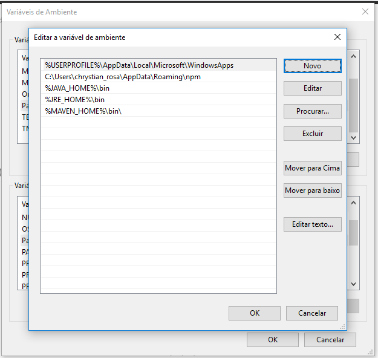

# Configuração das variáveis de ambiente Java Windows

## 1. Propriedades do Sistema

Digite *variáveis de ambiente* na caixa de pesquisa (ao lado do botão Iniciar do Windows), clique em `Editar as variáveis de ambiente do sistema`.

## 2. Variáveis do Ambiente

Selecione a guia `Avançado`, clique em `Variáveis de Ambiente`.

<p align="center"></p>

## 3. Adicionar JAVA_HOME

Em Variáveis do sistema, clique no botão `Novo...` para adicionar uma nova variável `JAVA_HOME` e apontá-la para a pasta instalada do JDK.

- [Nota]
Não inclua a pasta \bin, apenas a pasta do JDK. Por exemplo:
**Correto – C:\Program Files\Java\jdk1.8.0**
Errado – C:\Program Files\Java\jdk1.8.0\bin

<p align="center"></p>

<p align="center"></p>


## 4. Atualizar PATH

Nas **Variáveis de usuário**, encontre PATH, e clique no botão ***Editar...***:

### 4.1 Em uma versão mais antiga do Windows, irá exibir uma janela para editar os valores diretamente, concatene %JAVA_HOME%\bin; ao fim da linha.

### 4.2 Na ultima versão do Windows 10, irá exibir essa janela nova, clique em ***Novo*** e adicione `%JAVA_HOME%\bin`

<br>

<p align="center"></p>

- [Nota]
Colocar o ***%JAVA_HOME%\bin*** no caminho PATH faz todos os comandos Java (java, javac, jstack and etc) serem acessíveis por todos os usuários.

## 5. Teste

```C:\Users\Hugo>java -version
java version "1.8.0_202"
Java(TM) SE Runtime Environment (build 1.8.0_60-b27)
Java HotSpot(TM) 64-Bit Server VM (build 25.60-b23, mixed mode)

C:\Users\Hugo>javac -version
javac 1.8.0_60

C:\Users\Hugo>echo %JAVA_HOME%
C:\Program Files\Java\jdk1.8.0_202
```
