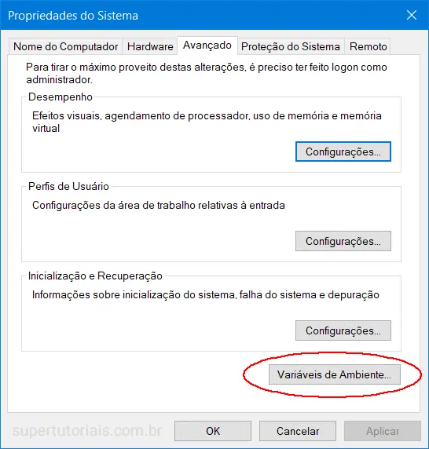

# configuracao-java-windows

## 1. Propriedades do Sistema

Digite *variáveis de ambiente* na caixa de pesquisa (ao lado do botão Iniciar do Windows), clique em `Editar as variáveis de ambiente do sistema`.

<p align="center"></p>

## 2. Variáveis do Ambiente

Selecione a guia `Avançado`, clique em `Variáveis de Ambiente`.

<p align="center"></p>

## 3. Adicionar JAVA_HOME

Em Variáveis do sistema, clique no botão `Novo...` para adicionar uma nova variável JAVA_HOME e apontá-la para a pasta instalada do JDK.

Note
Não inclua a pasta \bin, apenas a pasta do JDK. Por exemplo:
Correct – C:\Program Files\Java\jdk1.8.0_60
Wrong – C:\Program Files\Java\jdk1.8.0_60\bin


## 4. Atualizar PATH

In System variables, find PATH, clicks edit... button :

### 4.1 In old version of Windows, it will prompt you below dialog box to edit the values directly, append this %JAVA_HOME%\bin; to the end of the line.

*Note*
*Puts the %JAVA_HOME%\bin in PATH make all the Java’s commands (java, javac, jstack and etc) are accessible from everywhere.*

# 5. Test

```C:\Users\Hugo>java -version
java version "1.8.0_202"
Java(TM) SE Runtime Environment (build 1.8.0_60-b27)
Java HotSpot(TM) 64-Bit Server VM (build 25.60-b23, mixed mode)

C:\Users\Hugo>javac -version
javac 1.8.0_60

C:\Users\Hugo>echo %JAVA_HOME%
C:\Program Files\Java\jdk1.8.0_202
```
